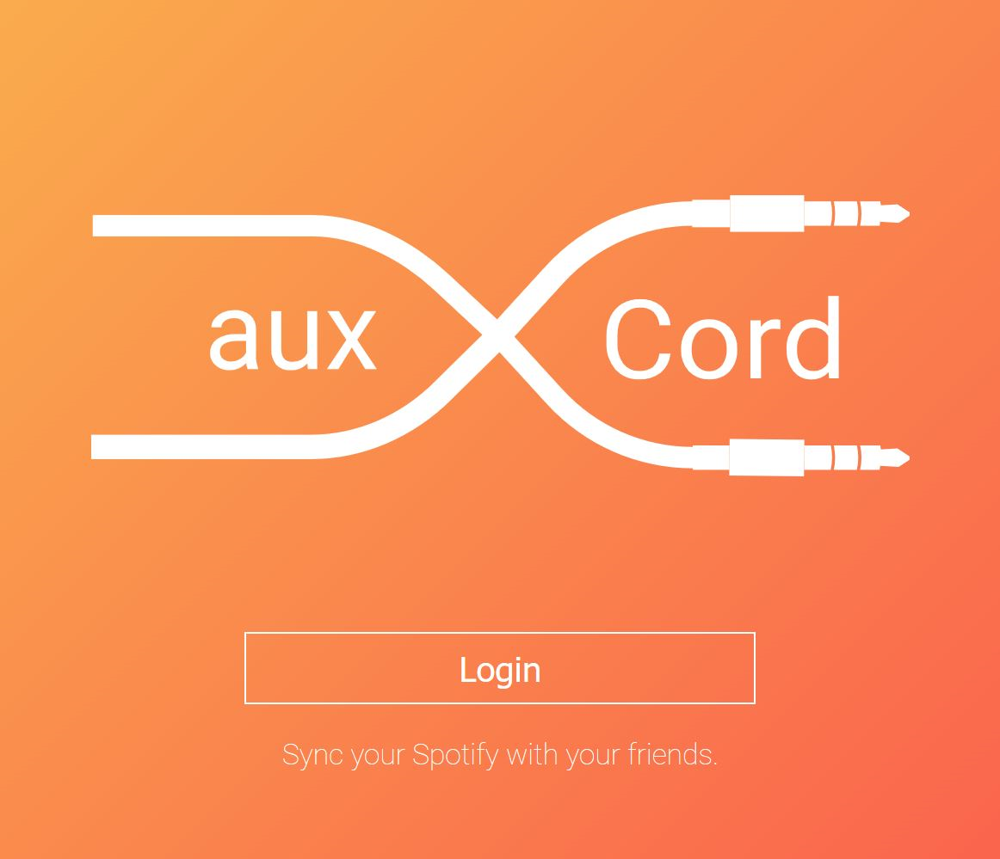

# auxCord

Sync Spotify accounts to build tailored playlists.

View the live site at [auxcord.io](http://auxcord.io)

## Setup

auxCord runs on Node.js. Install it [here](http://www.nodejs.org/download/).

After installation, clone this repo and run the following command inside the directory.

    $ npm install

In order to authenticate with the Spotify API you need to create a file called `keys.js` in the `src` directory
to store your client_id and client_secret. You can get your own API keys by creating a [Spotify app](https://developer.spotify.com/). Once you have your keys, add them to your file as shown below.

- Add your spotify keys to `.env` file based on `.env.example`

Finally run the server.

    $ node app.js

## To Do

* Allow for more than two users to sync their accounts
* Move .json file structure to some kind of database
* Add Google Analytics
* Allow users to choose whether to save playlists
* Add CSS animations
* Improve CSS design for mobile
* Add tags for SEO
* Extend data collection to recieve more than 50 playlists
* Extend data collection to reviece more than 50 tracks per playlist
* Fix socket.io socket management

### Won Best Cloud Based Hack at CUhackit 2018
